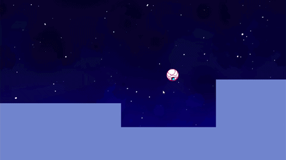

# Want You Gone
A SoftDes project made by [@awoolf07](https://github.com/awoolf07), [@Nyxune](https://github.com/Nyxune), and [@happysmaran](https://github.com/happysmaran)

## About
This is a video game designed using the `pygame-ce` library. It uses a custom 2D physics engine inspired by games like Red Ball, with a focus on collisions and realistic forces.

## Lore
After getting jettisoned by Chell in Chapter 9 "Finale" of Portal 2, Wheatley is now floating in space with nothing to do. He eventually crash lands on an alien planet with a multitude of structures, and he, not having anything better to do, performs the parkour.

## Unique Features
- Fully custom 2D Physics Engine
- Concave polygon Collision Support
- Level design using cutomizable JSON files
- On-Demand Bouncy Platform Physics on red platforms
- Wheatley

## How to Play
The player controls a simple character, shaped like a ball, and traverses a level via interacting with objects to proceed.

Keyboard Inputs:
- __W/Up__ - Jump
- __S/Down__ - Avoid Bounce
- __A/Left__ - Roll Reft
- __D/Right__ - Roll Right
- __R__ - Reset to Beginning

Jumping will not directly go up, but rather will apply a force to push the player away from whatever the character sits/hits. It is recommended to hold jump instead of click it when you want to jump, as the current collisions sometimes make jumping on demand difficult.

Rolling is subject to how an object behaves in the real world with rotational velocities. Left and Right will not immediately grant left and right movement.

"Down" simply refers to the ability to prevent bouncing on surfaces, especially on the dedicated bouncing surfaces. It is helpful to hold down when going downhill or wanting to gain speed.

## Video
[File Download](Want_You_Gone__SoftDes_Final_Video.mp4)

## Links
The GitHub page for this project can be found [here](https://github.com/olincollege/Want-You-Gone).

The GitHub code can be directly downloaded [here](https://github.com/olincollege/Want-You-Gone/archive/refs/heads/main.zip).

The project website can be found [here](https://effective-adventure-zgq6qjg.pages.github.io/).

The latest pre-built releases can be found [here](https://github.com/olincollege/Want-You-Gone/releases/latest) for Windows and macOS (Apple Silicon).

## Pre-requisites
__[WARN]__ Your computer should not be on "Efficiency" or "Battery Saver" mode for ideal results

- [Python 3.14.4](https://www.python.org/downloads/release/python-3144/#:~:text=Files) or later
- `pygame-ce`

(requirements.txt has this information)

## Installation
If you don't care about having the source code or do not want to use Python, use the pre-packaged variant.

#### Compile from Source
- Download the source files from the main project via the green "Code" button
- Extract the downloaded ZIP file
- In the terminal, run `pip install -r requirements.txt` inside the newly made folder
- Run the `main.py` file

#### Pre-packaged
- Download the package for your correct system from the `Releases` section
- Run it